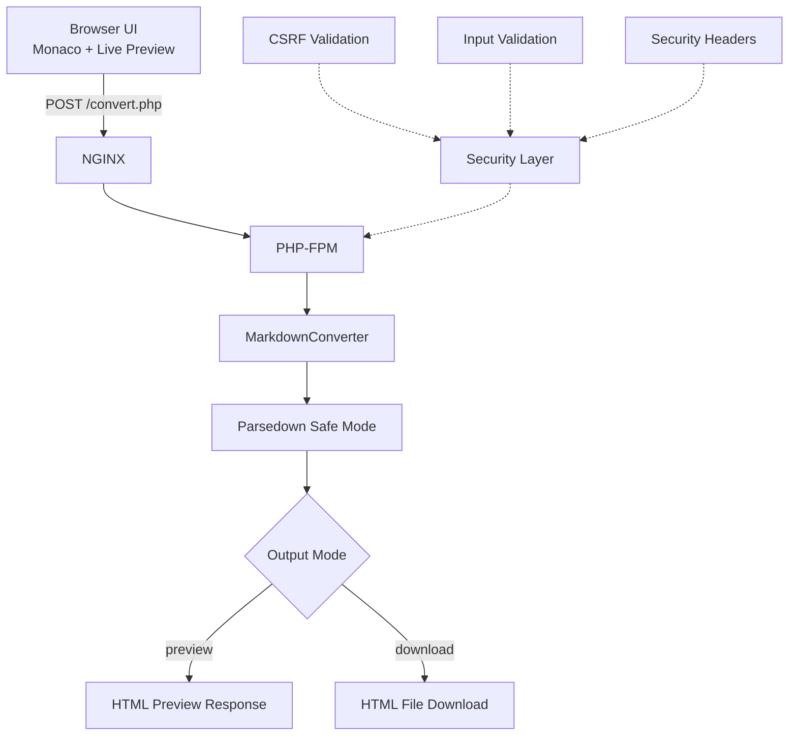

# Markdown to HTML Converter

Markdown を HTML に変換し、ライブプレビューとダウンロードを提供する Web アプリケーションです。Docker + NGINX + PHP-FPM + Parsedown で構成されています。

## 1. プロジェクト名
Markdown to HTML Converter

## 2. 概要
このプロジェクトは、ブラウザで入力した Markdown を HTML に変換するためのアプリです。入力内容はライブプレビューで確認でき、最終的に HTML ファイルとしてダウンロードできます。Web アプリ開発の基本構成（フロント、バックエンド、コンテナ運用、セキュリティ対策）を実践的に学ぶことを目的としています。

## 3. 特徴
- Monaco Editor によるリッチな Markdown 編集体験
- 右ペインでのライブプレビュー表示
- Preview / Download の出力モード切り替え
- Docker Compose で簡単に起動可能
- NGINX + PHP-FPM の実務で一般的な構成
- Parsedown の Safe Mode を利用した安全寄りの変換
- CSRF / 入力検証 / レスポンスヘッダーなどの基本的な防御実装

## 4. このプロジェクトを通して学べること・習得できること
このプロジェクトでは、単に Markdown を変換するだけでなく、実務寄りの Web 開発フロー全体を学べます。

### 4.1 アーキテクチャ設計の基礎
- リバースプロキシ（NGINX）とアプリ実行基盤（PHP-FPM）の責務分離
- 静的資産配信とアプリ処理の境界設計
- フロントエンドとバックエンドのデータフロー設計

### 4.2 セキュアコーディングの実践
- CSRF トークンの発行・埋め込み・検証
- 入力バリデーション（空文字・長さ・許可値）の実装
- XSS 対策（サニタイズ、Safe Mode、エスケープ）
- セキュリティヘッダー（CSP、X-Frame-Options、nosniff 等）の適用意図

### 4.3 フロントエンド実装の実践知
- Monaco Editor の初期化とフォーム同期
- ライブプレビューのレンダリング最適化（デバウンス）
- レイアウト崩れを防ぐ CSS 設計（グリッド、高さ制御、オーバーフロー設計）
- UX を損なわない段階的 UI 改善

### 4.4 バックエンド実装の基礎
- PHP でのエンドポイント分離（入力ページ / 変換処理）
- 例外系とエラー返却の設計
- 出力モード別レスポンス設計（ブラウザ表示 / ファイルダウンロード）

### 4.5 コンテナ開発と運用の基礎
- Docker Compose でのマルチコンテナ構成管理
- 開発時のボリュームマウント運用
- ローカル開発からデプロイ（EC2）を見据えた構成理解

### 4.6 開発プロセス
- 「まず動く最小構成を作る → 安全性補強 → リファクタリング」の進め方
- 小さな変更単位での実装と検証
- 機能追加時の回帰リスクを抑える進行管理

### 4.7 Mermaid 概念図


## 5. 必要条件
- Docker 24+
- Docker Compose v2
- Web ブラウザ（Chrome / Edge / Firefox / Safari 推奨）
- インターネット接続（CDN から Monaco / marked / DOMPurify 等を読み込む場合）

## 6. インストール手順
1. リポジトリをクローン
   ```bash
   git clone <YOUR_REPOSITORY_URL>
   cd mdtohtml
   ```
2. コンテナを起動
   ```bash
   docker compose up -d --build
   ```
3. 起動確認
   ```bash
   docker compose ps
   ```

## 7. 使用方法
1. ブラウザでアクセス
   - `http://localhost:8000`
2. 左ペインに Markdown を入力
3. 右ペインのライブプレビューで確認
4. 出力モードを選択
   - `Preview`: 変換結果を画面表示
   - `Download`: HTML ファイルとして保存
5. `Convert` ボタンを押して変換

## 8. 機能一覧
- Markdown 入力（Monaco Editor）
- ライブプレビュー
- Markdown → HTML 変換
- Preview 表示
- HTML ダウンロード
- 入力バリデーション
- CSRF 対策
- セキュリティヘッダー送出

## 9. 技術スタック
- Frontend
  - HTML / CSS / JavaScript
  - Monaco Editor
  - marked（ライブプレビュー補助）
  - DOMPurify（クライアント側サニタイズ補助）
- Backend
  - PHP 8.3 (PHP-FPM)
  - Parsedown
- Infrastructure
  - Docker / Docker Compose
  - NGINX (alpine)

## 10. 追加資料
- 設計・図表
  - [全体計画](plan.md)
  - [アーキテクチャ図](diagrams/architecture.md)
  - [コンポーネント図](diagrams/component.md)
  - [シーケンス図](diagrams/sequence.md)
  - [ユースケース図](diagrams/usecase.md)
  - [クラス図](diagrams/class.md)
  - [アクティビティ図](diagrams/activity.md)

## 11. 貢献方法
1. Issue を作成して課題・提案を共有
2. ブランチを作成
   ```bash
   git checkout -b feature/your-feature-name
   ```
3. 変更実装と動作確認
4. コミット
   ```bash
   git add .
   git commit -m "feat: add your feature"
   ```
5. プッシュして Pull Request を作成
   ```bash
   git push origin feature/your-feature-name
   ```

## 12. ライセンス
MIT License

> 補足: まだ `LICENSE` ファイルが未配置の場合は、運用前にルートへ追加してください。
