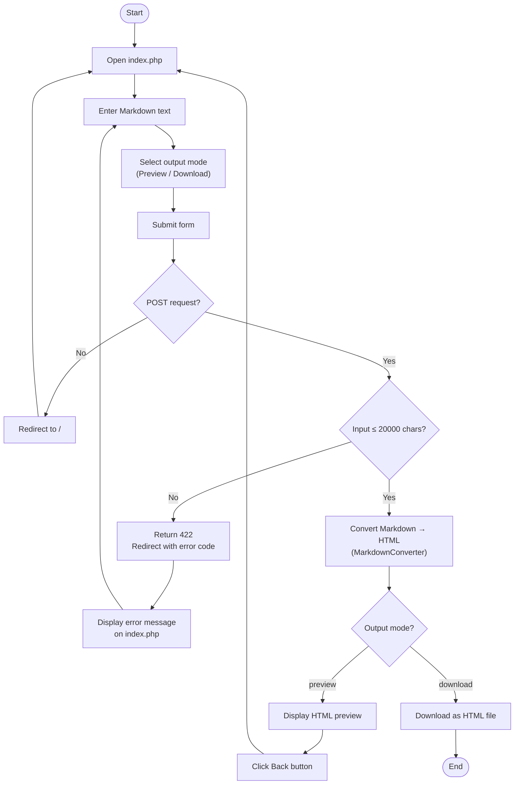

# Activity Diagram

```mermaid
flowchart TD
    Start([Start]) --> OpenIndex["Open index.php"]
    OpenIndex --> InputMarkdown["Enter Markdown text"]
    InputMarkdown --> SelectMode["Select output mode\n(Preview / Download)"]
    SelectMode --> Submit["Submit form"]
    Submit --> CheckMethod{POST request?}
    CheckMethod -->|No| RedirectIndex["Redirect to /"]
    CheckMethod -->|Yes| CheckLength{Input ≤ 20000 chars?}
    CheckLength -->|No| ReturnError["Return 422\nRedirect with error code"]
    ReturnError --> ShowError["Display error message\non index.php"]
    ShowError --> InputMarkdown
    CheckLength -->|Yes| Convert["Convert Markdown → HTML\n(MarkdownConverter)"]
    Convert --> CheckMode{Output mode?}
    CheckMode -->|preview| ShowPreview["Display HTML preview"]
    CheckMode -->|download| DownloadFile["Download as HTML file"]
    ShowPreview --> ClickBack["Click Back button"]
    ClickBack --> OpenIndex
    DownloadFile --> End([End])
    RedirectIndex --> OpenIndex
```
