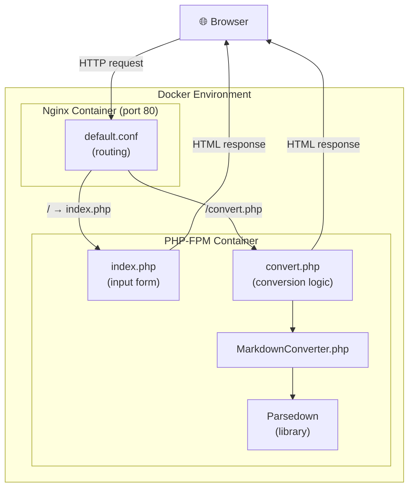

# Architecture Diagram

```mermaid
graph TD
    Browser["🌐 Browser"]

    subgraph Docker["Docker Environment"]
        subgraph Nginx["Nginx Container (port 80)"]
            NginxConf["default.conf\n(routing)"]
        end

        subgraph PHP["PHP-FPM Container"]
            IndexPHP["index.php\n(input form)"]
            ConvertPHP["convert.php\n(conversion logic)"]
            MarkdownConverter["MarkdownConverter.php"]
            Parsedown["Parsedown\n(library)"]
        end
    end

    Browser -->|"HTTP request"| NginxConf
    NginxConf -->|"/ → index.php"| IndexPHP
    NginxConf -->|"/convert.php"| ConvertPHP
    ConvertPHP --> MarkdownConverter
    MarkdownConverter --> Parsedown
    ConvertPHP -->|"HTML response"| Browser
    IndexPHP -->|"HTML response"| Browser
```
