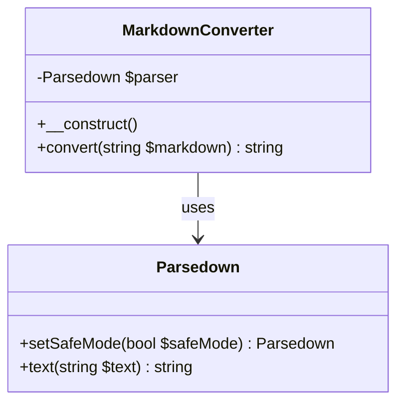

# Class Diagram

```mermaid
classDiagram
    class MarkdownConverter {
        -Parsedown $parser
        +__construct()
        +convert(string $markdown) string
    }

    class Parsedown {
        +setSafeMode(bool $safeMode) Parsedown
        +text(string $text) string
    }

    MarkdownConverter --> Parsedown : uses
```
