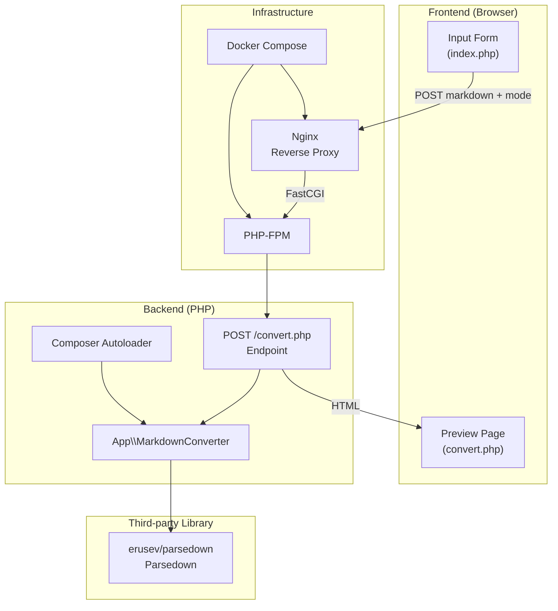

# Component Diagram

```mermaid
graph TD
    subgraph Frontend["Frontend (Browser)"]
        Form["Input Form\n(index.php)"]
        Preview["Preview Page\n(convert.php)"]
    end

    subgraph Backend["Backend (PHP)"]
        ConvertEndpoint["POST /convert.php\nEndpoint"]
        MarkdownConverter["App\\MarkdownConverter"]
        Autoloader["Composer Autoloader"]
    end

    subgraph Library["Third-party Library"]
        Parsedown["erusev/parsedown\nParsedown"]
    end

    subgraph Infrastructure["Infrastructure"]
        Nginx["Nginx\nReverse Proxy"]
        PHPFPM["PHP-FPM"]
        Docker["Docker Compose"]
    end

    Form -->|"POST markdown + mode"| Nginx
    Nginx -->|"FastCGI"| PHPFPM
    PHPFPM --> ConvertEndpoint
    ConvertEndpoint --> MarkdownConverter
    Autoloader --> MarkdownConverter
    MarkdownConverter --> Parsedown
    ConvertEndpoint -->|"HTML"| Preview
    Docker --> Nginx
    Docker --> PHPFPM
```
