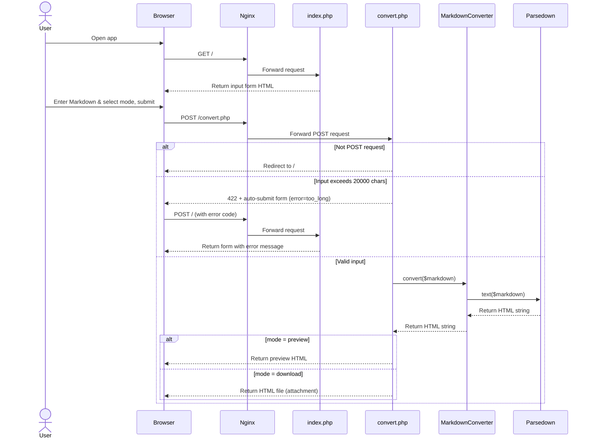

# Sequence Diagram

```mermaid
sequenceDiagram
    actor User
    participant Browser
    participant Nginx
    participant IndexPHP as index.php
    participant ConvertPHP as convert.php
    participant MarkdownConverter
    participant Parsedown

    User->>Browser: Open app
    Browser->>Nginx: GET /
    Nginx->>IndexPHP: Forward request
    IndexPHP-->>Browser: Return input form HTML

    User->>Browser: Enter Markdown & select mode, submit
    Browser->>Nginx: POST /convert.php
    Nginx->>ConvertPHP: Forward POST request

    alt Not POST request
        ConvertPHP-->>Browser: Redirect to /
    else Input exceeds 20000 chars
        ConvertPHP-->>Browser: 422 + auto-submit form (error=too_long)
        Browser->>Nginx: POST / (with error code)
        Nginx->>IndexPHP: Forward request
        IndexPHP-->>Browser: Return form with error message
    else Valid input
        ConvertPHP->>MarkdownConverter: convert($markdown)
        MarkdownConverter->>Parsedown: text($markdown)
        Parsedown-->>MarkdownConverter: Return HTML string
        MarkdownConverter-->>ConvertPHP: Return HTML string

        alt mode = preview
            ConvertPHP-->>Browser: Return preview HTML
        else mode = download
            ConvertPHP-->>Browser: Return HTML file (attachment)
        end
    end
```
