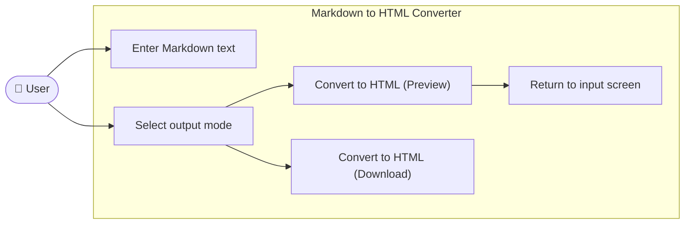

# Use Case Diagram

```mermaid
graph LR
    User(["👤 User"])

    subgraph "Markdown to HTML Converter"
        UC1["Enter Markdown text"]
        UC2["Select output mode"]
        UC3["Convert to HTML (Preview)"]
        UC4["Convert to HTML (Download)"]
        UC5["Return to input screen"]
    end

    User --> UC1
    User --> UC2
    UC2 --> UC3
    UC2 --> UC4
    UC3 --> UC5
```
